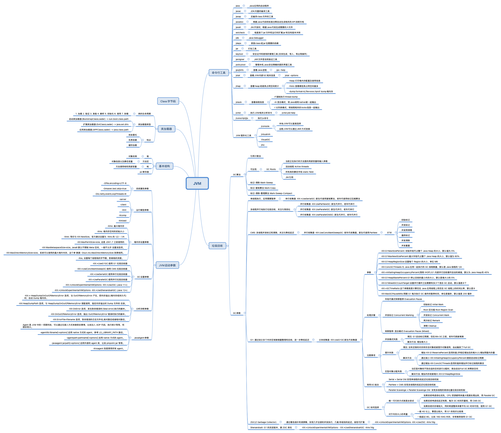
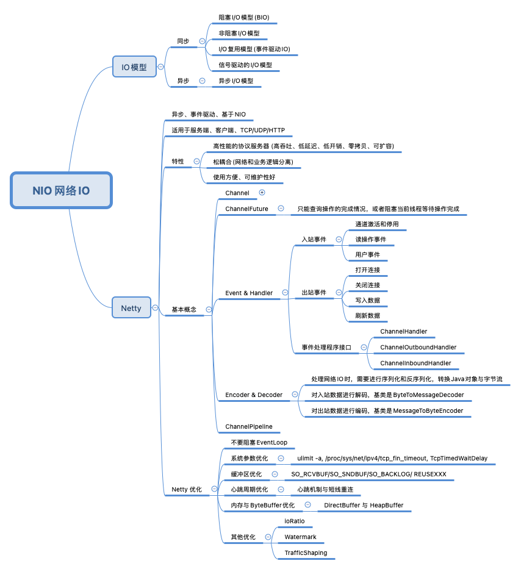
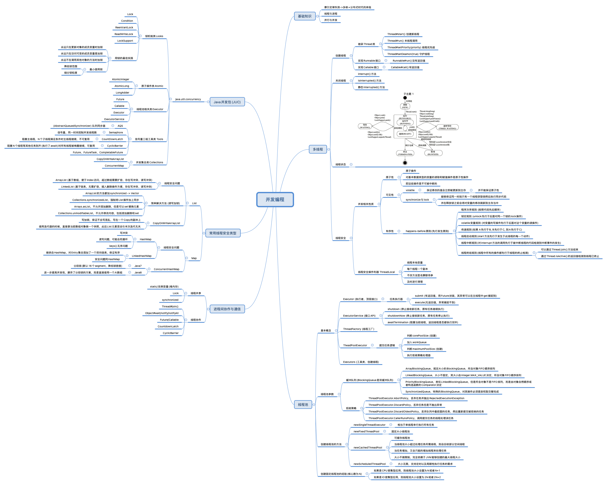
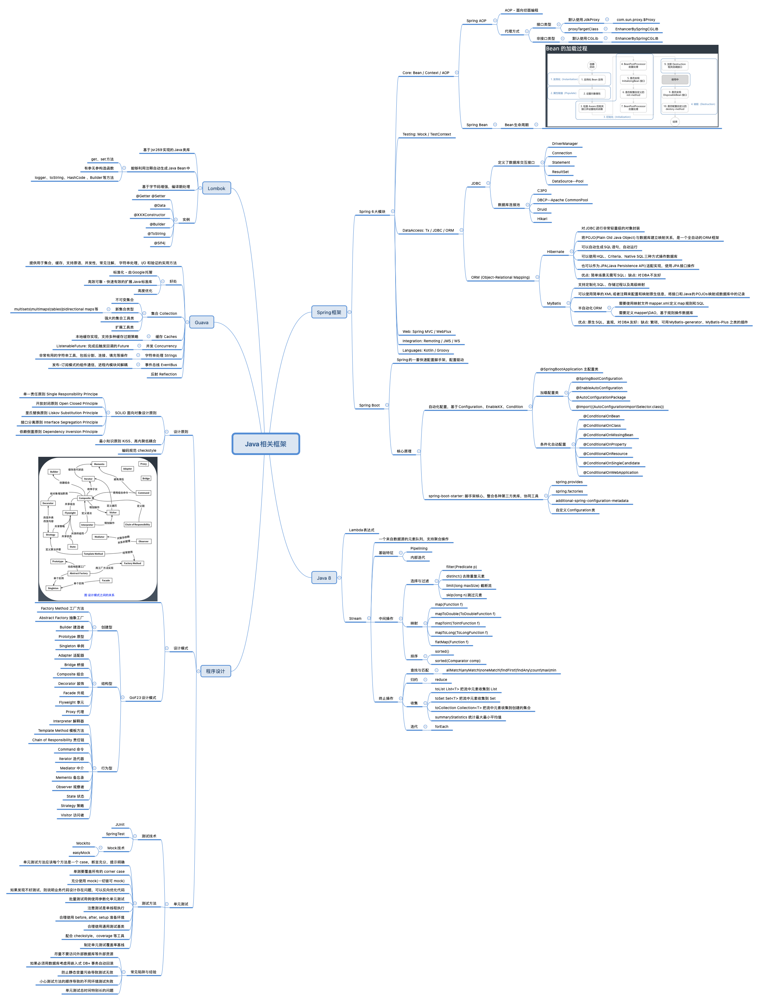
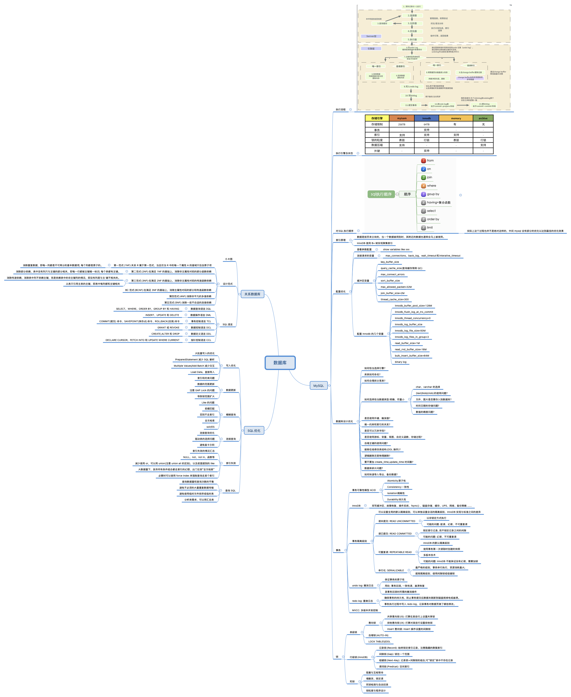
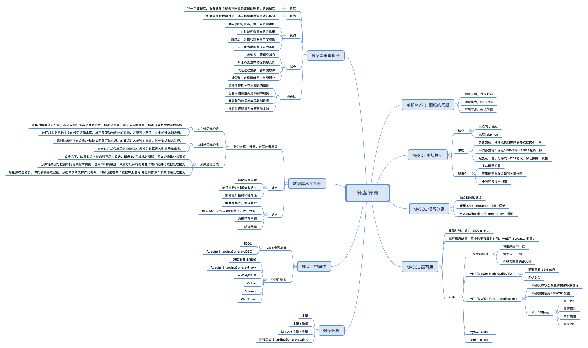
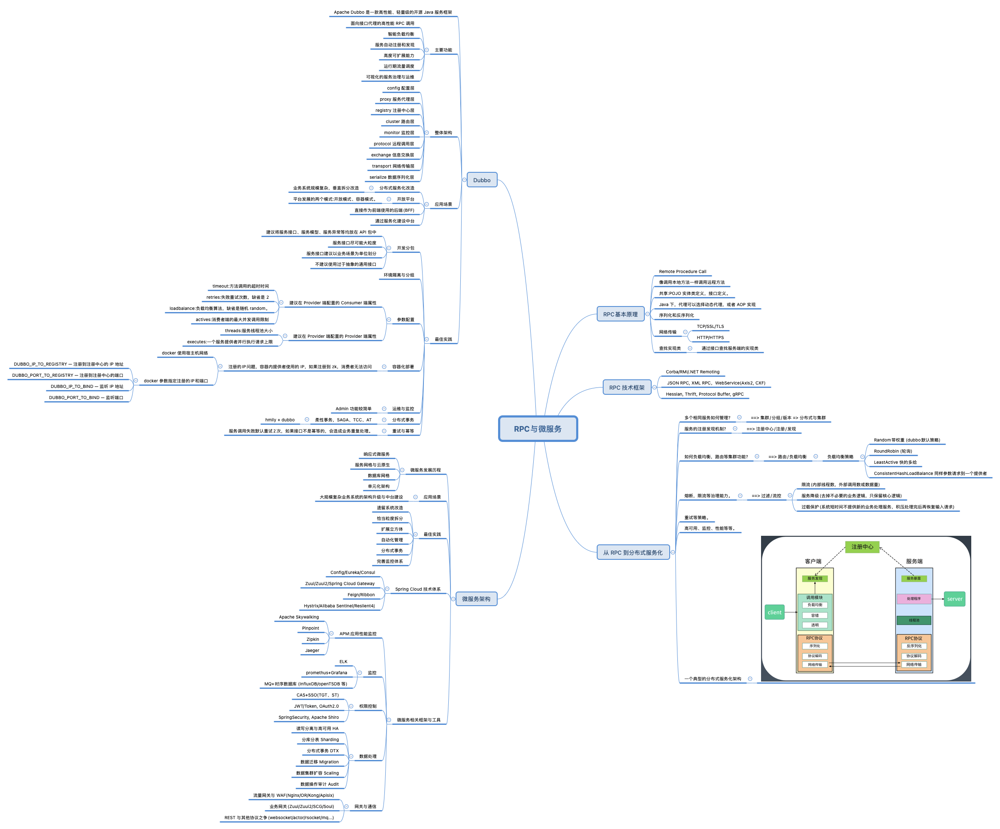
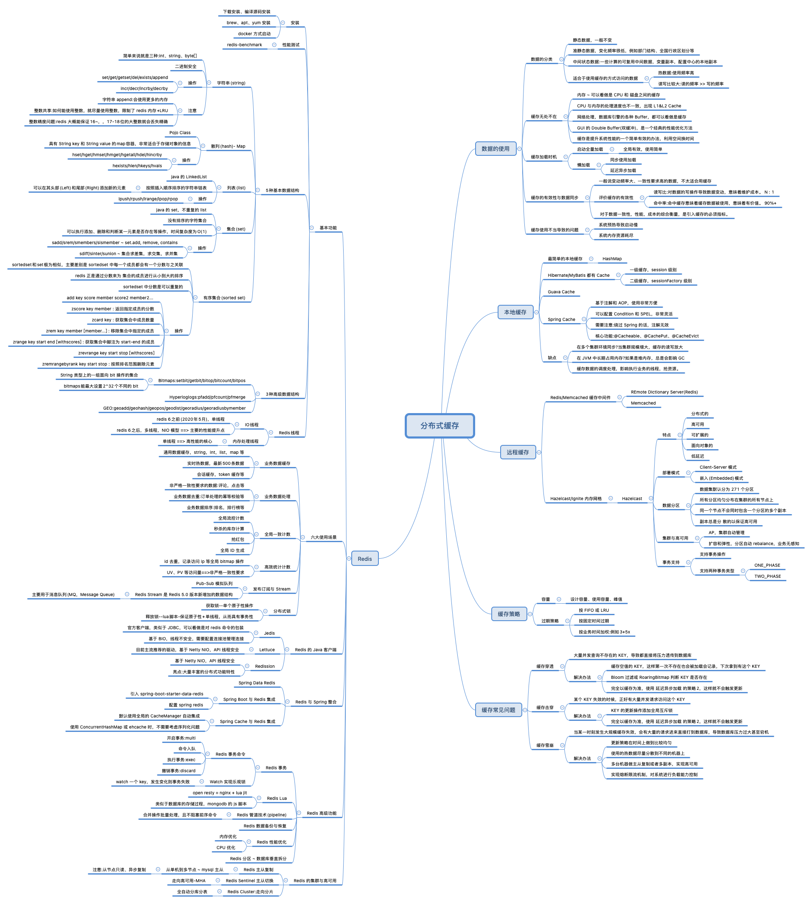
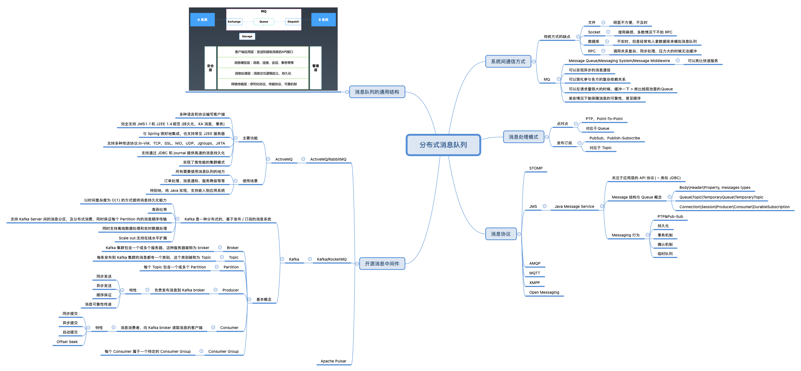

### 题目
1、(必做)分别用100个字以上的一段话，加上一幅图 (架构图或脑图)，总结自己对下列技术的关键点思考和经验认识:  
1)[JVM](###JVM)  
2)[NIO](###NIO)  
3)[并发编程](###并发编程)  
4)[Spring和ORM等框架](###Spring和ORM等框架)  
5)[MySQL数据库和SQL](###MySQL数据库和SQL)  
6)[分库分表](###分库分表)  
7)[RPC和微服务](###RPC和微服务)  
8)[分布式缓存](###分布式缓存)  
9)[分布式消息队列](###分布式消息队列)

### JVM
[回到列表](###题目)

### NIO
[回到列表](###题目)

### 并发编程
[回到列表](###题目)

### Spring和ORM等框架
[回到列表](###题目)

### MySQL数据库和SQL
[回到列表](###题目)

### 分库分表
[回到列表](###题目)

### RPC和微服务
[回到列表](###题目)

### 分布式缓存
[回到列表](###题目)

### 分布式消息队列
[回到列表](###题目)
